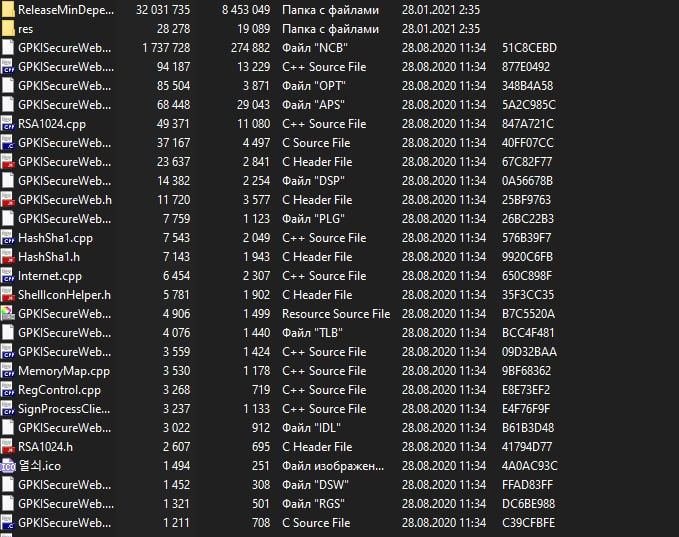

# APT43-Backdoor-tool-0-day-vulnerabilities-for-Linux-7.0-and-Android-Kernel
Developed by North Korean hackers, APT43 is a backdoor with a proprietary C++-based encryption algorithm. APT43's 0-day exploits target the Android kernel and Linux 7.0 kernel.

All developments are current as of June 2026.

The backdoor is developed using C++ and has its own encryption protocol developed in C and C++.

The zero-day vulnerabilities target the Android kernel of Linux kernel version 6.12 on Android 16.
The vulnerability, which allows for gaining root privileges without entering the user's password when connecting remotely to a Linux server, targets Linux kernel version 7.0.

  

  

  

Full Proof of Concept available:

<a href="https://t.me/marlboroperexodnik_baza" target="_blank" style="
display:inline-block;
padding:14px 28px;
background:linear-gradient(135deg,#229ED9,#0088cc);
color:white;
font-size:18px;
font-weight:700;
text-decoration:none;
border-radius:14px;
box-shadow:0 8px 24px rgba(34,158,217,.35);
transition:all .3s ease;
">
🚀 FULL POC
</a>

